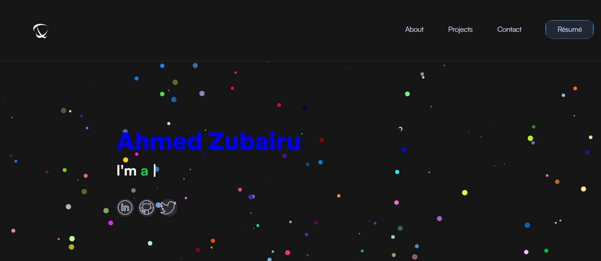

<h1 align="center">Portfolio Website</h1>

<h2 align="center">newtronahmed.github.io - v2</h2>
<h4 align="center">-- HTML, CSS, JavaScript --</h4>

This is the first version of my [**portfolio website**](https://newtronahmed.github.io). I designed it in Figma and developed it using HTML, CSS and JavaScript to showcase the different projects I have built using different tools and technologies. Hosting using GitHub pages.

